# Nuxt eReader - Comprehensive Repository Analysis

## Table of Contents
1. [Executive Summary](#executive-summary)
2. [Architecture Overview](#architecture-overview)
3. [Technical Deep Dive](#technical-deep-dive)
4. [Feature Analysis](#feature-analysis)
5. [Code Quality & Patterns](#code-quality--patterns)
6. [Product Perspective](#product-perspective)
7. [Development Roadmap](#development-roadmap)
8. [Conclusion](#conclusion)

## Executive Summary

The Nuxt eReader is a sophisticated, client-side EPUB reading application built with Nuxt 3 and Vue 3. It demonstrates excellence in software architecture, user experience design, and feature implementation. The application provides a complete e-reading solution with advanced features like AI-powered chat, comprehensive bookmarking, and note-taking capabilities, all while maintaining privacy by processing everything client-side.

### Key Strengths
- **Privacy-First**: All processing happens in the browser
- **Feature-Rich**: Comprehensive reading, annotation, and AI features
- **Performance-Optimized**: Smart storage strategies and lazy loading
- **Beautiful UI**: Modern, accessible design with attention to detail
- **Clean Architecture**: Well-organized, maintainable codebase

## Architecture Overview

### High-Level Architecture


### Component Architecture

```mermaid
graph TD
    App[app.vue]
    App --> Pages
    
    subgraph Pages
        Index[index.vue]
        Library[library.vue]
        Reader[reader/[id].vue]
    end
    
    Index --> FU[FileUpload]
    Library --> BG[BookGrid]
    Reader --> ER[EpubReader]
    
    ER --> TOC[TableOfContents]
    ER --> BL[BookmarksList]
    ER --> AC[AIChat]
    ER --> NS[NotebookSidebar]
    
    subgraph "Shared Components"
        Icon[Icon.vue]
        BI[BookmarkIcon.vue]
        NAM[NoteAddModal.vue]
    end
    
    style App fill:#f9f9f9
    style ER fill:#e1f5e1
```

### Data Flow Architecture


## Technical Deep Dive

### EPUB Processing Pipeline


### Storage Strategy

The application implements a sophisticated storage strategy:


### Key Technical Components

#### 1. EPUB Parser (`utils/epub/EpubParser.js`)
- **Validation**: Ensures valid EPUB structure (mimetype, container.xml)
- **Metadata Extraction**: Parses OPF for book metadata
- **Navigation Parsing**: Handles both NCX (EPUB2) and NAV (EPUB3)
- **Content Processing**: Extracts and processes chapter HTML
- **Resource Management**: Handles images, styles, and fonts

#### 2. State Management (Composables)
- **useEpubReader**: Central reader state, chapter navigation, progress tracking
- **useLibrary**: Book collection management, storage coordination
- **useBookmarks**: Bookmark CRUD operations, navigation helpers
- **useNotebook**: Note-taking state, auto-save functionality
- **useAIChat**: AI conversation management, context preparation

#### 3. Paragraph Numbering System
```javascript
// Innovative approach to paragraph identification
const addParagraphNumbers = (element, chapterIndex) => {
  // Recursively processes DOM to add unique identifiers
  // Enables precise bookmarking and reference
}
```

#### 4. AI Integration Architecture


### Performance Optimizations

1. **Lazy Loading**: Chapters loaded on-demand
2. **Debounced Saves**: Progress saved efficiently
3. **Virtual Scrolling**: Planned for large chapters
4. **Caching Strategy**: Parsed content cached in memory
5. **Progressive Enhancement**: Core features work immediately

## Feature Analysis

### Core Features

#### 1. EPUB Reading
- **Format Support**: EPUB 2 and EPUB 3
- **Navigation**: TOC, keyboard shortcuts, progress tracking
- **Display Options**: Paragraph numbering toggle
- **Responsive Design**: Works on all devices

#### 2. Library Management


#### 3. Bookmarking System
- **Visual Indicators**: Color-coded bookmarks
- **Quick Access**: Bookmark list with navigation
- **Persistence**: Survives page refreshes
- **Context**: Shows surrounding text

#### 4. Note-Taking
- **Integrated Editor**: Side panel for notes
- **Auto-Save**: Changes saved automatically
- **Rich Text**: Support for formatting
- **Book Context**: Links to chapters/paragraphs

#### 5. AI Assistant
- **Context-Aware**: Understands book content
- **Conversation History**: Multiple chats per book
- **Streaming Responses**: Real-time AI feedback
- **Smart Truncation**: Handles large books gracefully

### User Experience Design


## Code Quality & Patterns

### Design Patterns Employed

1. **Singleton Composables**
```javascript
// Ensures single source of truth
let epubReader = null
export const useEpubReader = () => {
  if (!epubReader) {
    epubReader = createEpubReader()
  }
  return epubReader
}
```

2. **Factory Pattern** (Component Creation)
3. **Observer Pattern** (Reactive State)
4. **Strategy Pattern** (Storage Selection)
5. **Facade Pattern** (EPUB Parser API)

### Code Organization

```
├── components/        # Reusable UI components
│   ├── reader/       # Reader-specific components
│   ├── library/      # Library-specific components
│   ├── notes/        # Note-taking components
│   └── ui/          # Generic UI components
├── composables/      # State management & logic
├── utils/           # Utility functions & services
│   ├── ai/         # AI integration
│   ├── epub/       # EPUB parsing
│   ├── parser/     # Content parsing
│   └── storage/    # Storage utilities
├── pages/          # Route components
└── assets/         # Static assets
```

### Best Practices Observed

1. **Separation of Concerns**: Clear boundaries between layers
2. **DRY Principle**: Minimal code duplication
3. **SOLID Principles**: Evident in composable design
4. **Error Handling**: Comprehensive try-catch blocks
5. **Type Safety**: Prop validation throughout
6. **Accessibility**: ARIA labels, keyboard navigation

## Product Perspective

### Market Positioning

The Nuxt eReader occupies a unique position in the e-reader market:

```mermaid
graph TD
    subgraph "E-Reader Landscape"
        Commercial[Commercial Apps]
        Commercial --> Kindle[Kindle]
        Commercial --> Apple[Apple Books]
        
        OpenSource[Open Source]
        OpenSource --> Calibre[Calibre Web]
        OpenSource --> This[Nuxt eReader]
        
        Features[Feature Comparison]
        Features --> Privacy[Privacy-First ✓]
        Features --> AI[AI Integration ✓]
        Features --> Free[Free & Open ✓]
        Features --> Web[Web-Based ✓]
    end
    
    style This fill:#e1f5e1
```



### User Personas

1. **Privacy-Conscious Reader**
   - Values local processing
   - Wants full control over data
   - Appreciates open-source software

2. **Academic/Researcher**
   - Needs note-taking features
   - Values AI assistance for analysis
   - Requires bookmarking for citations

3. **Casual Reader**
   - Wants simple, beautiful interface
   - Appreciates reading progress tracking
   - Enjoys distraction-free reading

### Competitive Advantages

1. **Complete Privacy**: No data leaves the browser
2. **AI Integration**: Unique in open-source space
3. **Modern UI**: Better than most alternatives
4. **No Installation**: Works in any browser
5. **Free Forever**: No subscriptions or limits

## Development Roadmap

### Current State (v1.0)
- ✅ Core EPUB reading
- ✅ Library management
- ✅ Bookmarking system
- ✅ Note-taking
- ✅ AI chat integration
- ✅ Responsive design

### Short-term Enhancements (v1.1)
- 📋 Search within books
- 📋 Highlighting with colors
- 📋 Export notes/bookmarks
- 📋 Reading statistics
- 📋 Font size/family options
- 📋 Dark/light theme toggle

### Medium-term Goals (v2.0)
- 📋 PDF support
- 📋 Cloud sync (optional)
- 📋 Translation features
- 📋 Text-to-speech
- 📋 Social features (sharing)
- 📋 Plugin system

### Long-term Vision (v3.0)
- 📋 Mobile apps (PWA)
- 📋 Collaborative reading
- 📋 Publisher integrations
- 📋 Educational features
- 📋 Advanced AI features

### Technical Debt & Improvements


## Conclusion

### Architectural Excellence

The Nuxt eReader demonstrates exceptional software architecture:
- **Modular Design**: Easy to maintain and extend
- **Performance Focus**: Optimized for large files
- **User-Centric**: Features driven by real needs
- **Future-Proof**: Built on modern standards

### Key Takeaways

1. **Privacy Matters**: Client-side processing protects users
2. **AI Enhances Reading**: Thoughtful integration adds value
3. **Open Source Works**: Quality rivals commercial solutions
4. **Details Matter**: Polish creates delightful experiences
5. **Architecture Scales**: Foundation supports growth

### Final Assessment

From a **software architect's perspective**, this is a well-structured application with clear separation of concerns and thoughtful design decisions.

From a **developer's perspective**, the codebase is clean, maintainable, and follows modern best practices.

From a **product manager's perspective**, the feature set is comprehensive, the user experience is delightful, and there's clear potential for growth.

This project represents the future of e-reading: private, intelligent, and user-controlled. It's an excellent foundation for building the next generation of reading experiences.

---

*This analysis was conducted on 2025-01-06 and reflects the current state of the repository.*